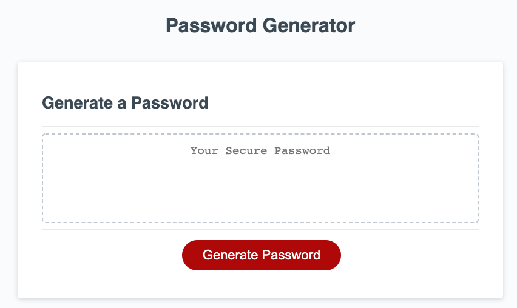

# [Password Generator](https://thadkingcole.github.io/Password-Generator)

A random password generator - made with javascript

## Table of Contents

* [Installation](#Installation)
* [Usage](#Usage)
* [License](#License)

## Installation

No installation necessary! Try it out yourself by [clicking here](https://thadkingcole.github.io/Password-Generator/).

## Usage

1. Navigate to <https://thadkingcole.github.io/Password-Generator>
2. Click the red "Generate Password" button towards the bottom of the page.

3. Follow the prompts
    1. Enter your desired password length (must be a number between 8 and 128)

    

    2. Click **OK** for each character type desired, or **cancel** to exclude that character type. Available character types include lowercase and uppercase english letters, numbers 0-9, and all [UTF-8 basic latin](https://www.w3schools.com/charsets/ref_utf_basic_latin.asp) special characters except SPACE. A list of each character type you have chosen to include will be listed in each prompt.

    
    
    
    

    >Note: You must click **OK** for at least one (1) character type.

    

4. Your generated password will be displayed in the middle of the dotted box.

5. You can generate as many passwords as desired by clicking the red "Generate Password" and following the prompts. Each new generated password is displayed in the same location as the last generated password.

    >Note: This app does NOT save any generated passwords, so once it is no longer displayed, it is gone forever. I recommend you either copy/paste or write down any generated password you want to use and keep it in a location others cannot find and/or access.

## Licence

[GPL 3.0](LICENSE)

[back to top](#Password-Generator)